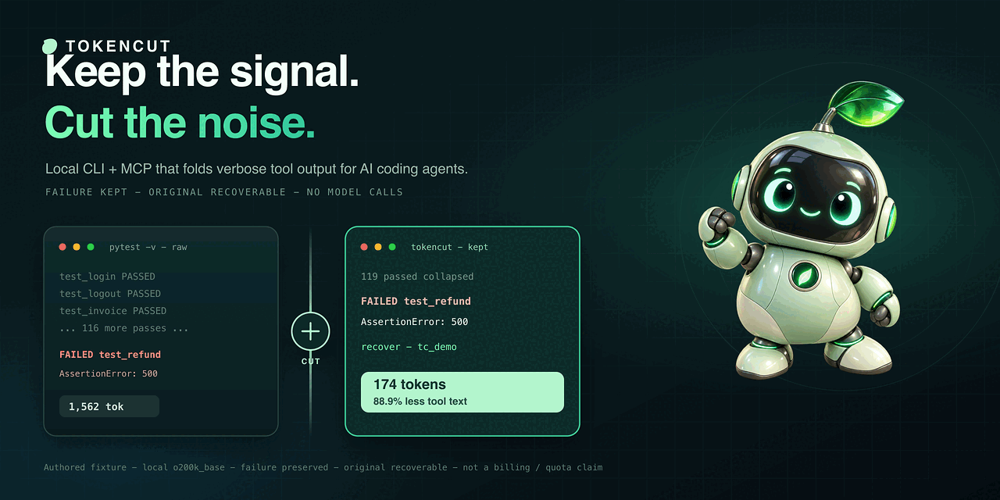
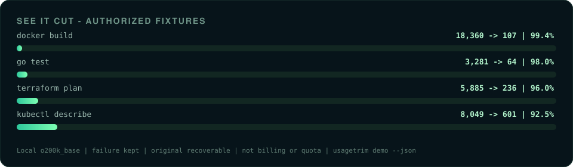
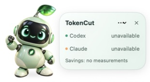
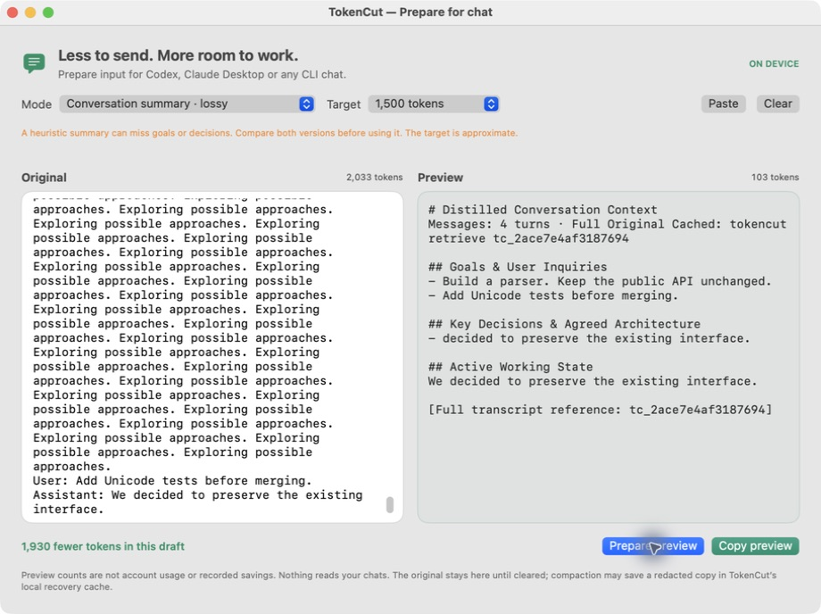

<p align="center">
  <picture>
    <source media="(prefers-reduced-motion: reduce)" srcset="assets/readme-hero.png">
    
  </picture>
</p>

<p align="center">
  <strong>Keep the signal. Cut the noise.</strong><br>
  Local CLI + MCP that folds verbose tool output for Claude Code, Codex, Cursor, and Claude Desktop — recoverable by reference. Optional macOS pet.
</p>

<p align="center">
  <a href="https://github.com/00200200/tokencut/actions/workflows/ci.yml"></a>
  <a href="https://github.com/00200200/tokencut/releases"></a>
  <a href="LICENSE"></a>
  <a href="https://modelcontextprotocol.io"></a>
  
  <a href="https://github.com/00200200/tokencut/stargazers"></a>
</p>

<p align="center">
  <a href="#install">Install</a> ·
  <a href="#see-it-cut">Demo</a> ·
  <a href="#what-you-get">Features</a> ·
  <a href="#connect-your-agent">Connect</a> ·
  <a href="#desktop-companion">Pet</a> ·
  <a href="docs/guide.md">Guide</a>
</p>

<p align="center">
  
</p>

---

## Install

Requires Python 3.11+ and [uv](https://docs.astral.sh/uv/getting-started/installation/).

```sh
uv tool install 'git+https://github.com/00200200/tokencut.git'
tokencut demo
```

> **Install from this GitHub repo.** The PyPI package named `tokencut` is a different project.

```
verbose tool text  →  keep the failure  →  recover the rest by reference
```

---

## See it cut

`tokencut demo` is offline — **no model calls**. Failures stay; originals recover exactly.

<p align="center">
  
</p>

<p align="center">
  
</p>

| Fixture | Tokens |
| --- | ---: |
| `docker build` BuildKit | 18,360 → **107** (99.4%) |
| `go test` + goroutine dump | 3,281 → **64** (98.0%) |
| `cargo test` + backtrace | 3,795 → **185** (95.1%) |
| pytest noisy (xdist + I/O) | 5,111 → **348** (93.2%) |
| pytest recovery demo | 1,562 → **174** (88.9%) |
| `vitest` / `eslint` / `tsc` | up to **98.8%** / **79%** |

Local `o200k_base` estimate — not billing, quality, or subscription-limit claims. Full matrix: `tokencut demo --json`.

```sh
tokencut run -- pytest -v
tokencut run -- docker build -t app .
tokencut run -- cargo test
tokencut run -- go test ./...
tokencut run -- npx eslint . --format codeframe
```

---

## What you get

- **Cut noise, keep the failure.** Specialized filters for pytest, Docker, cargo, go, vitest, eslint, tsc, mypy, pyright, git diff, ruff…
- **Session dedup + spill.** Same `run` output *or* identical `cat` / MCP `tokencut_read` view within ~15 minutes → short cache ref. Payloads over ~20 KiB → file + preview (`TOKENCUT_SPILL_BYTES`).
- **Recover by reference.** Omitted text stays in a local CCR cache: `tokencut retrieve tc_…`
- **Measure it.** `tokencut gain` / MCP `tokencut_gain` — per-tool-family savings and passthrough candidates (local estimates, not account quotas).
- **Desktop-ready.** MCP for Claude Code / Codex / Cursor / Claude Desktop; Prepare-for-chat clipboard flow; optional macOS pet.

```sh
tokencut gain
tokencut gain --history
tokencut gain --passthrough
tokencut prepare --file draft.txt
```

[Details and tradeoffs →](docs/guide.md)

---

## Connect your agent

**Desktop & Coding profiles:** 9–11 essential tools instead of 16 — about **36–38% smaller tool schemas** in local `o200k_base` measurements (3,414 → 2,183 / 2,102). Not a per-turn usage guarantee.

```sh
# One-command installer for Codex & Claude Desktop
tokencut install --codex            # configures ~/.codex/config.toml
tokencut install --claude-desktop   # configures Claude Desktop MCP
tokencut install --mcpb             # Extension manifest for one-click packaging
tokencut install --all              # configures all at once
```

For Claude Code CLI:
```sh
claude mcp add --scope user tokencut -- tokencut mcp --profile coding
```

Manual MCP configuration for Claude Desktop, Cursor, Codex, Windsurf:

```json
{
  "mcpServers": {
    "tokencut": {
      "command": "/absolute/path/to/tokencut",
      "args": ["mcp", "--profile", "desktop"]
    }
  }
}
```

Path: `command -v tokencut`. Use `--profile full` for every tool, `--profile coding` for core terminal tools, or `--profile desktop` for chat apps. [Client setup →](docs/guide.md#connect-clients)

```sh
# Prepare messy logs or stack traces with prompt-cache prefix stabilization:
tokencut prepare --desktop -f error.log

# Initialize or optimize lean, cache-aligned instructions (CLAUDE.md / AGENTS.md):
tokencut rules --init --client claude        # writes lean CLAUDE.md (~120 tokens)
tokencut rules --init --client codex         # writes lean AGENTS.md (~120 tokens)
tokencut rules --optimize --write -f CLAUDE.md # strips filler, aligns prompt caching
```

---

## Desktop companion

Mint robot on your Mac — draggable pet or menu-bar mode. Local measurements, task memory, optional account-limit readings. English UI. No extra AI calls.

<p align="center">
  
</p>

*Example balances are remaining allowance — not savings caused by TokenCut.*

<p align="center">
  
</p>

*Prepare for chat — paste a log, preview the cut, copy into Codex / Claude Desktop. [Log prep →](assets/macos-prepare.png)*

**macOS 13+ · ad-hoc signed, not notarized.** CLI and MCP work without the pet. [Build →](docs/guide.md#macos-companion)

---

## Make it better with us

If TokenCut earns a place in your workflow, **[star the repo](https://github.com/00200200/tokencut/stargazers)**. Lost context or a missed cut? [Open an issue](https://github.com/00200200/tokencut/issues/new) with a small redacted example.

<p align="center">
  <a href="https://star-history.com/#00200200/tokencut&amp;Date">
    <picture>
      <source media="(prefers-color-scheme: dark)" srcset="https://api.star-history.com/svg?repos=00200200/tokencut&amp;type=Date&amp;theme=dark" />
      <source media="(prefers-color-scheme: light)" srcset="https://api.star-history.com/svg?repos=00200200/tokencut&amp;type=Date" />
      
    </picture>
  </a>
</p>

[Guide](docs/guide.md) · [Measurements](docs/guide.md#measurements-and-development) · [MIT](LICENSE)
