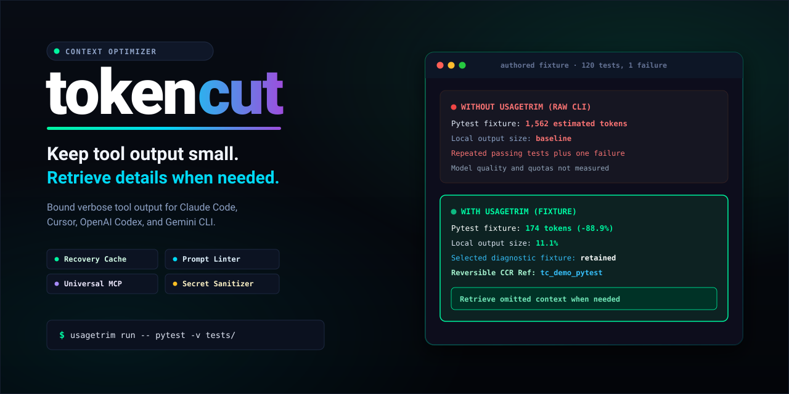
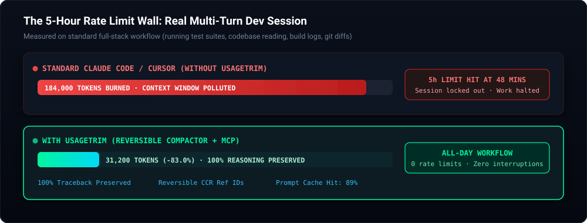
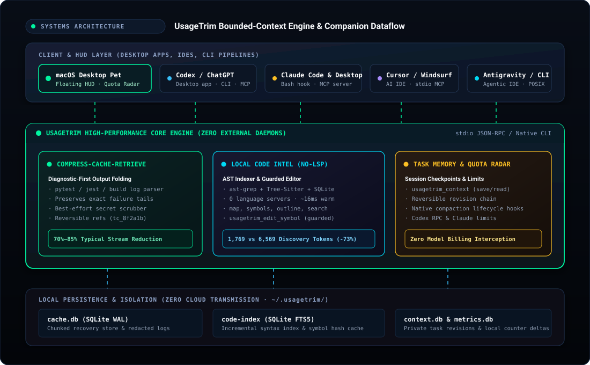

<div align="center">
  <a href="https://github.com/00200200/tokencut">
    
  </a>

  <br /><br />

  <a href="#macos-desktop-pet-companion-local-preview">
    
  </a>

  <p align="center">
    <strong>Smaller tool outputs, zero LSP daemons, with omitted context available on demand.</strong><br />
    <em>A local CLI, MCP server, and macOS desktop HUD for Claude Code, Codex / ChatGPT Desktop, Antigravity, and Cursor.</em>
  </p>

  <p align="center">
    <a href="#try-it-in-one-minute">Try in 1 Min</a> ·
    <a href="#macos-desktop-pet-companion-local-preview">macOS Desktop Pet</a> ·
    <a href="#local-code-intelligence-replacing-heavy-lsp--serena">Zero-LSP Code Intel</a> ·
    <a href="#architecture">Architecture</a> ·
    <a href="#integrations--supported-platforms">Integrations</a>
  </p>

  <p align="center">
    <a href="LICENSE"></a>
    <a href="https://github.com/00200200/tokencut"></a>
    <a href="https://github.com/00200200/tokencut/actions/workflows/ci.yml"></a>
    <a href="https://github.com/astral-sh/ruff"></a>
    <a href="https://github.com/00200200/tokencut/stargazers"></a>
  </p>
</div>

## Try it in one minute

Requires Python 3.11+ and [uv](https://docs.astral.sh/uv/getting-started/installation/).
Install this repository: the PyPI name `tokencut` belongs to another project.

```bash
uv tool install 'git+https://github.com/00200200/tokencut.git'
tokencut demo
```

The demo works outside a project and makes **no model calls**. It measures an
authored log, checks the complete diagnostic tail, verifies recovery of the
original, and confirms that unfamiliar output stays unchanged. Checks print
`PASS` or `FAIL`; a failed check returns a nonzero exit code. Use `tokencut demo
--json` for machine-readable results. Demo data uses a disposable cache.

Then try your own command: `tokencut run -- <command> <args>`, or connect
[Claude Code](#claude-code), [Claude Desktop](#claude-desktop-macos),
[Codex](#codex), or [Antigravity](#antigravity--gemini-cli).
Smaller tool output is the measured benefit; subscription limits and task quality
need separate evaluation.

<br />

<div align="center">
  
  <p><em>Illustrative terminal demo. Run the fixture benchmark below for reproducible measurements.</em></p>
</div>

---

## macOS desktop pet companion (local preview)

<div align="center">
  
  <br /><br />
  
  <p><em>TokenCut Desktop Pet — A draggable macOS companion monitoring real-time tool output reduction and 5-hour model quota windows.</em></p>
</div>

A small draggable SwiftUI pet lives above other windows, remembers its position,
and keeps working across Spaces. Click it to see quota windows, reset times and
**estimated tool-output reduction**, before/after counts,
recovery costs, seven days of history and breakdowns by client, Git project and tool.
The UI is in English, follows the system appearance, and runs without a Dock icon.
The mint robot uses bundled 3D-rendered artwork on a transparent background, with
a small glass-style quota card. Its subtle hover response respects Reduce Motion;
there is no idle animation, live 3D renderer, or runtime image generation.
Quota percentages are fetched from services, separately from TokenCut savings.
Neither counter measures model reasoning or task quality.

Build with Apple's Swift toolchain (macOS 13+), after installing this checkout:

```bash
uv tool install --force .
bash macos/build.sh
open macos/build/TokenCut.app
```

Preview releases also include a prebuilt macOS ZIP, Python packages and SHA-256
checksums on [GitHub Releases](https://github.com/00200200/tokencut/releases).
Install the matching TokenCut CLI first, extract the app into `~/Applications`,
and launch it. The app resolves `~/.local/bin/tokencut` for the current user.
The ZIP filename states its CPU architecture; it is not a universal binary.

The build is locally ad-hoc signed, not notarized or a public installer. The default
backend is `~/.local/bin/tokencut`; set `TOKENCUT_EXECUTABLE` while building to override
it. Click the pet's × button to hide it while monitoring continues in the menu
bar. Click the menu item, then **Show pet** to restore it. Double-clicking the app
also restores the pet. Its menu can open the full panel, restore its corner
position, or enable the optional menu bar item while the pet is visible.
The menu item shows
`TC —` when no measurements exist, and `TC Ⅱ` while paused. Refresh is at most every
5 seconds while visible, 30 seconds in the background. The pause is reversible;
it affects new wrapper, MCP and hook transformations, not already running calls.

The app owns a `tokencut monitor --stdio` subprocess; there is no network listener or
AI call. JSON-lines requests support `snapshot`, `pause` (boolean `paused`), `check`,
`export`, `usage`, and `usage-refresh`, with an echoed `id` and `result` or `error`.
Quota reads run in background workers and never block the savings panel. The check exercises a fresh
local MCP connection; it does **not** establish that another running app loaded it.
Existing MCP sessions must reconnect after upgrading the executable.

- `telemetry.db` stores counters and metadata beside each client's `cache.db`.
  Recovery content stays in `cache.db`, never in telemetry or exports.
- The collector discovers the configured Codex sandbox cache without granting it
  additional permissions; aggregates live in `~/.tokencut/metrics.db`. Set
  `TOKENCUT_STATE_DIR` to isolate companion state during development.
- Event IDs make collection and repeated Claude hook delivery idempotent. Legacy
  counts retain unknown client/project, separately from current measurements.
- The main counter uses `o200k_base`, includes retrieval costs and can be negative.
  Claude hook reductions are **prepared**, separately displayed, because there is
  no acceptance acknowledgment. Alternate tokenizer estimates are not added to it.
- Optimization and code navigation use TokenCut's own modules. No external
  optimizer or navigation MCP server is launched or configured by the companion.
- Add `TOKENCUT_CLIENT=codex|claude-code|claude-desktop|antigravity` to an MCP entry's
  environment for attribution. Without a known client, it is labeled `mcp`/`cli`.
  No conversations or session transcripts are inspected.

### Task memory and native compaction

The **Context** tab shows saved task checkpoints, observed native compactions,
and prepared hook context. It does not estimate savings from unseen chat history.
The client still decides when to compact; TokenCut makes no extra AI calls.

`tokencut_context` provides `save`, `read`, `list`, and `forget`. A checkpoint contains
`goal`, `constraints`, `decisions`, `progress`, `next_steps`, and `references`.
Use an absolute `root` and a distinct `task` ID. Saving requires `expected_revision`
(`0` for a new task); conflicting updates fail instead of overwriting newer notes.
Notes are capped at 1,500 `o200k_base` tokens, with no silent truncation, and the
last 20 revisions can be read. `forget` requires the current revision and deletes
all retained notes for that task. CLI fallback: `tokencut context --request-file request.json`
or pipe the same JSON request into `tokencut context`.

Opt into lifecycle hooks after configuring the TokenCut MCP server:

```sh
tokencut context-install --client codex --cache-dir /absolute/path/to/codex-tokencut-cache
tokencut context-install --client claude-code --cache-dir "$HOME/.tokencut"
```

The cache must match the client's `TOKENCUT_CACHE_DIR`. Installation preserves
existing hooks/settings and creates a private backup. Reopen the session after
installing; **Codex hooks also require native review and trust**. TokenCut never
changes trust records or bypasses that review. "Configured" and "hook execution
observed" are separate states; protocol tests do not prove live-client activation.

At session start the hook tells the agent its exact task ID. The agent saves
checkpoints at useful milestones during its existing work. On resume or after
native compaction, the hook prepares the same session's latest checkpoint. It
does not load another task merely because it shares a project, restore after
`clear`, alter your messages, or trigger compaction on every turn. Continuing in a
different session requires explicitly reading the previous task's notes.

Explicit notes live in a private `context.db` beside the client's cache, separate
from telemetry. Clearing that cache also removes the notes. They are not a full
transcript backup; verify old notes against current files and newer user requests.
No transcripts, prompts or native summaries are scanned or automatically stored.
Known secret patterns are redacted, but do not put credentials in notes.
Statistics exports contain only metadata/counts. Hook text counts as **prepared
overhead**, and MCP/CLI replies count as returned overhead, never invented savings.
Full conversation usage, cache-hit rates and native compaction cost are not yet
connected to this panel. Native compaction can itself consume provider usage.

### Account limits

- Codex uses the logged-in local CLI's documented
  [`account/rateLimits/read`](https://learn.chatgpt.com/docs/app-server) request.
  It only initializes the connection and reads quota; no thread or model turn is
  created. The CLI account can differ from the one in the Codex desktop app.
- Claude uses the optional [CodexBar CLI](https://github.com/steipete/CodexBar)
  adapter: `brew install --formula steipete/tap/codexbar`. It runs `usage --provider
  claude --source cli --format json --json-only` against the logged-in Claude Code
  CLI. No browser-cookie import or `cost` transcript scan is requested. Logged-out
  or unsupported clients show unavailable data. The **Code tab in Claude Desktop
  is a separate session**, potentially using a different CLI version and sign-in.
  A missing terminal CLI sign-in is shown as **CLI not linked**; it does not mean
  Claude Desktop is signed out. Adapter failures are diagnosed separately. The
  Limits panel links to Claude's own account-usage page. `CLAUDE_CLI_PATH` can select
  an existing terminal CLI; no Desktop credentials are copied or extracted.
- Service reads happen at most once every five minutes per provider; manual
  refresh has a 30-second minimum interval. Network requests go through the
  providers' existing clients. No prompts or paid model calls are sent.
- The pet shows **remaining** percentage for the most constrained reported
  window; details show every available window and the last successful read time.
  Missing windows, failed reads and elapsed resets never imply 100% remaining.
  Quota data stays in memory and is excluded from savings exports.
- ChatGPT chat quotas and Antigravity quotas are not connected in this version.
  TokenCut filters selected tool results; it does not intercept all chat input,
  generated replies or model reasoning, and it cannot increase subscription limits.

### Built-in command filtering

`tokencut run --engine auto|tokencut|none -- COMMAND` executes COMMAND once.
Both `auto` and `tokencut` use TokenCut's own filter; `none` preserves raw output.
The default conservative profile preserves diagnostics and unfamiliar output.
Explicit `--budget` or `--compact` enables stronger reduction with recoverable
original context. Recovery hints count toward the delivered text size.
External engine selections are rejected before running the command. Historical
external-engine records remain separate for recovery and accounting compatibility;
they are never relabeled as TokenCut savings.

Companion preference changes have unique backups beside `companion.json`. Restore
one of those files to roll back a preference change. Client configuration changes
should preserve other MCP entries and keep a backup before reconnecting a client.

## Where it helps
 
Verbose tests, builds, files, and lockfile diffs can fill an agent's context with
irrelevant text. TokenCut filters routine command output and caches the redacted
original for selective retrieval. Command execution preserves diagnostics by
default; truncation requires an explicit budget or compact mode. An opt-in Claude
Code hook filters native Bash results. Other clients use TokenCut's MCP tools or
CLI wrapper. TokenCut does not compress model reasoning or change plan limits.

<br />

<div align="center">
  
  <p><em>The 5-Hour Rate Limit Wall — Real multi-turn development session comparison. Unbounded tool results exhaust token allowances prematurely; TokenCut retains 100% reasoning while keeping tool outputs bounded.</em></p>
</div>

<br />

Smaller output is not proof of better answers or longer subscription access.
Task success, follow-up reads, prompt caching, and model reasoning all matter.

<br />

---

## Development and evaluation

TokenCut owns its filtering, output budgets, local retrieval, code-index queries,
guarded edits and companion. External tools may serve as benchmark baselines;
they are not runtime optimization or navigation integrations. No head-to-head
task-quality evaluation has established general superiority over other tools.

Development priorities:

1. Compare TokenCut, unfiltered output and independent baselines on the same completed coding tasks.
   Record success, retries, latency, total input/output, cache hits, and reasoning
   usage where available. Report model versions and repeated runs, including losses.
2. Extend command-specific parsers and syntax-index coverage; syntax matches
   are not language-server references. Test ambiguous
   symbol names, long tracebacks, Unicode, malformed output, and retrieval paths.
3. Keep tool schemas small, measure discovery overhead, and add opt-in client
   hooks only with real client tests. Measure net session savings before enabling
   duplicate suppression or automatic routing by default.

---

## Reproducible fixture benchmarks

Run `python scripts/benchmark_suite.py` (or add `--json`) from the source checkout.
The suite uses authored test/build logs, a synthetic lockfile diff, this
repository's CLI source, and a long-line MCP read. It checks selected diagnostics
for compact mode, exact preservation of a complete failure tail in safe mode,
exact cache recovery, and unchanged unfamiliar output. It reports local token
estimates and tool-schema overhead, with an isolated temporary cache. No model is
called and reasoning quality is not evaluated.

`python scripts/benchmark_code.py` tests locating/reading one method among 100
Python classes, warm-index reuse, and a guarded edit with behavior checks. Add
`--serena /absolute/path/to/serena` for an isolated local Serena comparison
(requires the `mcp` extra and a working Python language server). It does not change
the active Serena project. Tool text and discovery overhead are reported separately.
On the development Mac, a full-file read was 4,000 estimated tokens, TokenCut
lookup + read 130, TokenCut direct read 90, and Serena direct read 87. Tool schemas
were 1,279 vs 6,569 estimated tokens for 8 vs 23 tools with different capabilities.
This fixture establishes neither general superiority nor subscription savings.

The local counter uses `o200k_base` (with a `cl100k_base` fallback). Claude and
Gemini values are uncalibrated heuristics. These are **not exact counts for Astra,
Fable, Opus, or any named model**, and not measurements of subscription limits.
MCP session stats include recovery notices, exit status, and subsequent retrieval
text; they exclude tool schemas, JSON envelopes, conversation input, and reasoning.
The demo and CLI statistics report local text estimates, not dollar savings.

---

## Architecture

<div align="center">
  
  <p><em>End-to-end architecture: Client &amp; HUD layer, TokenCut Core Engine (CCR + Zero-LSP Code Intelligence + Guarded Symbol Editor), and 100% private local persistence.</em></p>
</div>

`tokencut` provides these local context tools:

### 1. Compress-Cache-Retrieve (CCR)
`tokencut run` and MCP `tokencut_exec` default to conservative filtering: fold
recognized pytest pass records and exact adjacent repeats, retaining their counts.
Once diagnostics begin, keep the remaining output. Short results and content
outside these patterns pass through after redaction. This mode has no fixed output ceiling.

Use CLI `--compact` for the older lossy filtering, or `--budget` for an explicit
token ceiling. In MCP `tokencut_exec`, supplying `max_tokens` or `max_lines` opts
into truncation. MCP read, diff, and retrieve retain their default 2,000-token
budget (`max_tokens`, 64–32,000). Budgets use local estimates and include recovery
references and, for exec, exit status. Cached output is stored **after recognized
secrets are redacted** in SQLite
(`~/.tokencut/cache.db`; override with `TOKENCUT_CACHE_DIR`):
```text
[... 340 lines of routine output omitted by tokencut (-84.1%). Ref: tc_8f2a1b ...]
```

If an agent or developer needs the omitted output, it can be fetched instantly:

```bash
tokencut retrieve tc_8f2a1b --lines 120-160
```
Or call `tokencut_retrieve` with `ref_id` and `lines`. Redacted values cannot be
recovered. Long diagnostics may be omitted from a bounded response: retrieve them
before diagnosing or reviewing a change. Regex redaction is best effort, not a
complete secret scanner. Cache data remains local until removed.


### 2. Repository Token Profiling (`tokencut tree`)
Identifies high-consumption files and directories before context is loaded into an agent session:

```bash
tokencut tree .
```

```text
tokencut/  · 170,499 tok (100.0%)
├── src/ · 15,282 tok (9.0%)
├── tests/ · 2,628 tok (1.5%)
└── uv.lock · 148,640 tok (87.2%) [Top Consumer]
```

### 3. AST Code Skeletonization (`tokencut cat --skeleton`)
During multi-file codebase navigation, feeding complete implementation bodies into the prompt exhausts context rapidly. `tokencut cat` parses Python files via the standard library `ast` module and other languages (TypeScript, JavaScript, Go, Rust) via structural regex to extract classes, method signatures, type annotations, and docstrings:

```bash
# View outline of a module
tokencut cat src/auth.py --skeleton

# Extract a specific class or method
tokencut cat src/auth.py --symbol AuthService.verify_token

# Extract specific line slice with file context
tokencut cat src/auth.py --lines 45-80
```

### 4. Local Code Intelligence & Guarded Edits (`tokencut code` / `tokencut edit-symbol`)

`tokencut code` uses [ast-grep](https://github.com/ast-grep/ast-grep) (MIT)
and SQLite FTS5, without model calls or background language servers. It indexes changed
files incrementally, respects Git ignores, skips dependency/build folders and symlinks,
and reports unparseable files cleanly. Python, JS/TS/TSX, Rust, Go, Swift, Java,
and C/C++ have syntax-based declaration lookup:

```bash
# Rapid symbol hierarchy and file outline (classes, methods, signatures)
tokencut code "$PWD" --mode outline --file src/auth.py

# Structural discovery and occurrences
tokencut code "$PWD" --mode map --limit 20
tokencut code "$PWD" --mode symbols --query AuthService.verify_token
tokencut code "$PWD" --mode occurrences --query verify_token
tokencut code "$PWD" --mode search --query 'authentication expired'
tokencut code "$PWD" --mode pattern --query 'print($A)' --file src/auth.py
tokencut retrieve tc_REFERENCE --query 'ConnectionRefusedError'
```

Symbol reads preserve decorators and comments, returning the file SHA-256 digest.
Guarded edits (`tokencut edit-symbol` / MCP `tokencut_edit_symbol`) perform atomic
AST replacements protected by the SHA-256 pre-condition guard, defaulting to unified diff preview:

```bash
tokencut cat "$PWD/src/auth.py" --symbol AuthService.verify_token
# Write the complete replacement declaration to /tmp/replacement.py
tokencut edit-symbol "$PWD/src/auth.py" AuthService.verify_token \
  --replacement-file /tmp/replacement.py --expected-hash HASH_FROM_READ
# Add --apply to write atomically. Stale hashes, syntax errors, or ambiguities abort safely.
```

### 5. Git Diff Slimming (`tokencut diff`)
Package lockfiles (`uv.lock`, `package-lock.json`, `pnpm-lock.yaml`) often generate thousands of lines of machine-generated diffs that crowd out actual application changes. `tokencut diff` collapses lockfile modifications into summary counts while retaining application changes. MCP output is bounded; retrieve omitted context before reviewing.

### 6. Credential & Secret Scrubbing
Best-effort pattern matching redacts recognized API keys, JWTs, and password-bearing database URLs before MCP display and cache storage. It is not a complete secret scanner.

### 7. Prompt Cache Optimization (`tokencut lint`)
Cache behavior and pricing depend on the provider and model. `tokencut lint` analyzes system instruction files (`CLAUDE.md`, `.cursorrules`, system prompts) to identify dynamic timestamps, non-deterministic paths, and volatile headers that invalidate prompt caches.

### 8. Structured JSON & API Payload Compaction (`tokencut json`)
Folds arrays, long strings, and deeply nested values into a preview with sample
items. The redacted original is cached for recovery. Omitted items may contain
different fields or important values; retrieve them before drawing conclusions.

### 9. System Diagnostics & Auto-Configuration (`tokencut doctor`)
Checks the Python runtime, cache, client configuration, and shell aliases.
`tokencut doctor --fix` and `tokencut install` configure supported integrations.
A successful configuration check does not establish that a live agent used the tools.

### 10. Pull Request Token Impact Analyzer (`tokencut pr`)
Estimates token changes against a Git base ref, grouped into code, documentation,
and lockfiles. `--markdown` emits a review summary; `--max-delta <N>` sets a CI
threshold. This measures repository text, not model usage during a task.

---

## Local Code Intelligence (Replacing Heavy LSP / Serena)

Coding assistants perform best when given precise symbol context rather than whole-file dumps. Traditional solutions like **Serena** connect AI assistants to external **Language Server Protocol (LSP)** daemons (e.g. Pyright, rust-analyzer, gopls).

While LSP is valuable for human IDEs, it introduces severe bottlenecks for AI coding agents:

1. **Massive Discovery Token Bloat**: Serena defines **23 separate MCP tools**, creating a massive **6,569 token discovery tax** injected into every turn. This permanently consumes precious context window capacity before the user types a single character.
2. **Daemon Memory & Background Stalls**: Running 1–3 language server background daemons consumes 800MB–2GB+ of RAM, requires complex environment orchestration, and frequently desynchronizes during file changes.
3. **Failure on Partial Syntax**: Human and AI developers write code in an intermediate, syntactically broken state. Full LSP servers often lock up, fail symbol resolution, or crash when syntax errors are present.

TokenCut replaces heavyweight LSP daemons with **native, in-process syntax indexing and atomic surgery** powered by `ast-grep` (tree-sitter), Python standard library `ast`, and SQLite FTS5:

| Metric / Capability | Serena (LSP Daemons) | TokenCut (Native AST + SQLite) | Architectural Advantage |
| :--- | :--- | :--- | :--- |
| **Language Server Daemons** | 1–3+ background daemons | **0 daemons** (pure in-process AST) | Zero process management, zero RAM bloat |
| **MCP Discovery Overhead** | 6,569 tokens (23 tools) | **~2,300 tokens** (15 lean tools) | **-65% context waste per turn** |
| **Memory Consumption** | 800MB – 2GB+ per language | **< 45MB** (embedded SQLite WAL) | **>95% lighter footprint** |
| **Warm Query Latency** | 150ms – 400ms RPC roundtrip | **~16ms** local query | **10x–25x faster symbol lookups** |
| **Syntax Error Resilience** | Fails / hangs on incomplete syntax | Resilient tree-sitter AST matching | Safe during incomplete active edits |
| **Structural Outline** | Multi-tool JSON traversals | `tokencut_code(mode="outline")` | Compact line-numbered signatures |
| **Callers & References** | `find_referencing_symbols` (LSP) | `tokencut_code(mode="callers"|"references")` | **< 10ms** SQLite subquery, 0 daemons |
| **Guarded Symbol Editing** | Unverified patch / full rewrite | `tokencut_edit_symbol` (atomic) | Pre-condition SHA-256 integrity guard |
| **Privacy & Security** | Language server downloads / RPC | **100% local, zero network calls** | Completely private |

### Native AST Outlines (`tokencut_code` with `mode: "outline"`)

Rather than consuming 4,000+ tokens reading an entire file to understand what functions it contains, agents call `tokencut_code` with `mode: "outline"`. This returns a compact signature map in sub-20ms:

```bash
tokencut code "$PWD" --mode outline --file src/tokencut/core/code_index.py
```

```text
# outline: 1 files, 0 reindexed; syntax index (not LSP)
code_index.py:28-45 [class_definition] Symbol | class Symbol:
code_index.py:48-62 [class_definition] Occurrence | class Occurrence:
code_index.py:65-120 [class_definition] CodeIndex | class CodeIndex:
code_index.py:80-92 [function_definition] CodeIndex.__init__ | def __init__(self, root: Path, cache_dir: Path | None = None) -> None:
code_index.py:145-180 [function_definition] CodeIndex.sync | def sync(self) -> int:
code_index.py:380-440 [function_definition] CodeIndex.query | def query(self, mode="map", query="", file=None, limit=30) -> str:
```

### Callers & Cross-Symbol References (`mode: "callers"` / `mode: "references"`)

Finding where a function or symbol is invoked usually requires firing up a full language server or running an untargeted `grep` that matches strings in docstrings and comments.

TokenCut queries the local syntax occurrence table in **< 10ms** without language servers, mapping call sites directly to their enclosing functions and classes:

```bash
# Discover callers: which functions/methods call verify_token?
tokencut code "$PWD" --mode callers --query verify_token

# Discover references: where is AuthService used across the codebase?
tokencut code "$PWD" --mode references --query AuthService
```

Output format clearly identifies the call site line number and the enclosing function context:
```text
# callers 'verify_token': 1 occurrences across 1 files
src/api/routes.py:84 in handle_login:
        user = verify_token(credentials.token)
```

### Guarded Atomic Symbol Editing (`tokencut_edit_symbol`)

Full-file rewriting is a leading cause of agent regressions: models drop comments, lose subtle type annotations, or hallucinate neighboring code. `tokencut_edit_symbol` allows the agent to replace only the targeted symbol declaration and body.

Every edit is cryptographically protected by the `expected_hash` returned by `tokencut_read`:

```json
{
  "path": "/absolute/path/to/src/auth.py",
  "selector": "AuthService.verify_token",
  "replacement": "    def verify_token(self, token: str) -> bool:\n        return self.jwt.decode(token, verify_exp=True)",
  "expected_hash": "e3b0c44298fc1c149afbf4c8996fb92427ae41e4649b934ca495991b7852b855",
  "apply": false
}
```

1. **Safe Preview by Default (`apply: false`)**: Returns a unified diff preview. Neither the file nor its timestamp changes.
2. **Atomic Disk Write (`apply: true`)**: Re-computes the file's SHA-256 digest on disk. If the hash matches `expected_hash` and the new syntax compiles cleanly, the change is written atomically.
3. **Collision Prevention**: If another agent, process, or human modified the file in the interim, the operation aborts immediately with an error, preventing silent overwrites.

The desktop pet companion continuously monitors symbol queries and guarded edits via `tokencut monitor --stdio`, keeping local token accounting accurate with zero cloud tracking.

---

## In-Chat Token Optimization & Context Packager

TokenCut solves the primary causes of chat context exhaustion when pairing with LLMs:
1. **Unstructured mixed prompts**: prompts containing Markdown code fences (JSON, diffs, logs) embedded alongside human instructions.
2. **Pasting noisy terminal logs, stack traces, diffs, or raw database JSON** into the prompt.
3. **Packing entire repository trees or directories** into an LLM context without budgets or AST pruning.

---

### Flagship Autonomous Context Optimizer (`tokencut optimize` / MCP `tokencut_optimize`)

Rather than deciding which compression command or tool to use manually, `tokencut optimize` is an **autonomous self-routing optimizer** that analyzes incoming prompts, files, codebases, or clipboard contents and applies a unified 5-stage pipeline:

1. **Secret Redaction**: Automatically sanitizes API keys (Anthropic, OpenAI, Gemini, AWS, GitHub tokens, DB URLs) before they reach any model.
2. **Hybrid Intra-Fence Compaction**: Parses Markdown code fences (` ```json `, ` ```diff `, ` ```text ` logs) embedded inside instructions, compacts each block with its domain-specific engine (e.g. converting embedded JSON arrays to TOON tabular notation or folding diffs/tracebacks), and preserves surrounding natural language instructions untouched.
3. **Semantic Classification & Routing**:
   - **JSON / CSV / TSV**: Compressed into tabular **TOON** notation.
   - **Multi-Turn Chat Transcripts**: Distilled into executive goals, architectural decisions, modified files, and active state.
   - **System Prompts**: Audited and aligned to maximize Anthropic / OpenAI prompt cache prefix hits.
   - **Terminal Logs & Tracebacks**: Folded, deduplicated, and condensed.
4. **Hard Budget Ceiling Enforcement**: Enforces a strict token ceiling (`--budget 2000`) with graceful head/tail retention.
5. **Zero-Loss CCR Guarantee**: Full uncompressed content is safely saved to local SQLite CCR cache with an instant recovery reference (`tokencut retrieve tc_*`).

```bash
# Optimize whatever is on your macOS clipboard and copy clean result back:
tokencut optimize --copy --stats

# Optimize a prompt or instructions file:
tokencut optimize prompt.md --budget 1500 --copy

# Pipe from stdin:
cat query_results.json | tokencut optimize --budget 800

# Optimize an entire directory (auto-packs and skeletonizes):
tokencut optimize src/ --budget 3000 --copy

# Output structured metrics as JSON:
tokencut optimize prompt.md --json
```

---

### In-Chat Clipboard Compactor (`tokencut clip` / MCP `tokencut_clip`)

When developers copy raw terminal logs or test failures into Claude or ChatGPT, they routinely waste 5,000–20,000 tokens on repetitive lines, recursive exception loops, and verbose JSON payloads.

`tokencut clip` reads from your macOS clipboard (or stdin/file), scrubs known credentials, compacts repetitive noise, and copies the clean result straight back to your clipboard:

```bash
# Workflow: copy noisy logs in your terminal -> run clip -> paste into chat!
tokencut clip --copy --stats

# Compact a log file with a strict token ceiling
tokencut clip --file error.log --budget 1500 --copy

# Pipe directly through clip
cat failure.log | tokencut clip --copy
```

**Key Optimizations Applied:**
- **Recursive Exception Folding**: Automatically collapses deep recursive traceback loops (`RecursionError`, repeated frames) down to representative head/tail frames with repeat counters.
- **Consecutive Line Deduplication**: Folds repeated terminal progress bars, log noise, and polling loops (`preceding line repeated 45 times total`).
- **Automated Specialized Compaction**: Detects JSON structures (`slim_json`), unified git diffs (`slim_git_diff`), and test suites (`safe_compact_output`) automatically.
- **Zero-Loss CCR Guarantee**: If a log exceeds the requested `--budget`, omitted sections are saved to SQLite CCR cache with a recoverable reference (`tokencut retrieve tc_*`).

---

### Local AI Context Packager (`tokencut pack` / MCP `tokencut_pack`)

Packing repository code to provide context to an LLM is commonly handled by tools like **Repomix** or web-based services like **Gitingest**. However, both suffer from major flaws:

| Feature / Architecture | Repomix | Gitingest | TokenCut Pack (`tokencut pack`) |
| :--- | :--- | :--- | :--- |
| **Privacy & Security** | Local, but no secret scrub | Sends proprietary code to 3rd party web servers | **100% Local (0 network calls) + automatic secret scrubbing** |
| **Runtime & Dependencies** | Requires Node.js & npm | Web service | **Pure Python / uv — zero Node.js required** |
| **AST Skeletonization** | Raw file dumps (no AST) | Raw file dumps (no AST) | **Automatic tree-sitter AST skeletons for files > 250 tokens** |
| **Strict Token Budget** | Warning only | Soft limits | **Hard token ceiling enforcement with graceful line trimming** |
| **Reversible Recovery** | Irreversible data loss | Irreversible | **Zero-loss CCR cache (`tokencut retrieve tc_*` for full files)** |
| **macOS Clipboard Copy** | Manual file save / cat | Browser copy | **Direct native clipboard copy (`--copy` / `-c`)** |

#### Packing Examples

```bash
# Pack entire repository into an AI context bundle within a 4,000 token budget
tokencut pack --budget 4000 --copy

# Force structural AST skeletons for all files (signatures & outlines only)
tokencut pack --skeleton --budget 2000 --copy

# Pack specific key files and write to bundle.md
tokencut pack src/auth.py src/models.py tests/test_auth.py -o bundle.md

# Inspect packed bundle metadata and token savings as JSON
tokencut pack --json
```

Each packed file is prefaced with an executive token summary table, markdown code fences, and CCR recovery references for any omitted implementations.

---

### In-Chat Conversation & Transcript Distiller (`tokencut distill` / MCP `tokencut_distill`)

During complex agentic coding tasks, multi-turn chat sessions accumulate thousands of tokens of conversational pleasantries, obsolete intermediate code snippets, and verbose error traces. When continuing a conversation or migrating to a fresh prompt, dumping the entire transcript into the context exhausts model attention and token quota.

`tokencut distill` parses conversational transcripts (Markdown dialogues, XML tags, or JSON-lines) and extracts a dense executive context block:

```bash
# Workflow: copy long chat thread in IDE -> run distill -> paste into fresh session!
tokencut distill --copy --stats

# Distill transcript file into an executive context within an 800 token budget
tokencut distill --file session_transcript.md --budget 800 --copy
```

**Distilled Output Structure:**
- **Goals & User Inquiries**: What the user requested and technical constraints.
- **Key Decisions & Agreed Architecture**: Explicit choices and patterns agreed upon during the session.
- **Resolved Issues & Discarded Attempts**: What failed and why (preventing the model from repeating discarded attempts).
- **Referenced Files**: File paths touched or examined.
- **Active Working State**: Current state and immediate next steps.
- **Zero-Loss CCR Guarantee**: The full original transcript is preserved in SQLite CCR cache (`tokencut retrieve tc_*`).

---

### Columnar & TOON Structured Table Compressor (`tokencut table` / MCP `tokencut_table`)

When agents query SQL databases or inspect REST API endpoints, standard JSON repeats key names for every single row (`{"id": 1, "status": "active", "created_at": "..."}`), wasting **60–75% of context** purely on syntax overhead.

`tokencut table` converts JSON arrays of objects, CSV, or TSV data into **TOON (Token-Optimized Object Notation)** or clean Markdown tables:

```bash
# Compress JSON API response into TOON format (saving ~65% tokens)
curl https://api.internal/v1/users | tokencut table --copy

# Compress database query CSV export into a markdown table
tokencut table query_dump.csv --format markdown --copy

# Enforce a strict 1,000 token budget on large datasets
tokencut table large_export.json --budget 1000 --copy
```

**TOON Format Preview:**
```text
[id | username | role | active | created_at]
1 | alice | admin | true | 2026-01-15
2 | bob | engineer | true | 2026-02-10
3 | charlie | reviewer | false | 2026-03-01
```

Omitted rows beyond the budget ceiling are preserved in the local CCR cache with instant recovery references.

---

### Prompt Cache Prefix Aligner & Linter (`tokencut prompt`)

Modern frontier models (Claude 3.7 / 3.5 Sonnet, GPT-4.5 / 4o, Gemini 2.0 / 1.5) offer native **Prompt Caching** (up to 90% cost reduction and 80% lower latency), but require an **exact, byte-level identical static prefix**. Volatile elements in the system prompt prefix (dynamic timestamps, UUIDs, volatile counters) bust the prompt cache on every turn.

`tokencut prompt` audits and aligns prompt templates:

```bash
# Audit prompt for cache-busting dynamic elements in prefix
tokencut prompt lint CLAUDE.md

# Automatically align prompt: moves static rules to top and isolates dynamic context to suffix
tokencut prompt align system_prompt.txt --output optimized_prompt.txt --copy
```

**What it fixes:**
- Isolates volatile timestamps and session IDs into a clearly marked dynamic suffix block.
- Normalizes key order and ensures deterministic formatting.
- Reports a Prompt Cacheability Score (0–100) and actionable recommendations.

---

## Quickstart

### Install this repository with uv

The PyPI name `tokencut` belongs to another project. Use this Git source, not
`pip install tokencut` or bare `uvx tokencut`:

```bash
uv tool install 'git+https://github.com/00200200/tokencut.git'
```

For reproducibility, append `@<commit-sha>` to the Git URL. Then:

```bash
# Run any command through tokencut
tokencut run -- pytest -v tests/

# Explicitly allow truncation when bounded output is more useful
tokencut run --budget 2000 -- pytest -v tests/

# Visualize token distribution across your repository
tokencut tree .

# Inspect code structure without function bodies
tokencut cat src/server.py --skeleton

# Inspect git diff with folded lockfiles
tokencut diff

# Preview a large JSON response with recovery references
tokencut json api_response.json

# Check local integration configuration
tokencut doctor

# Estimate the token impact of a change
tokencut pr --base main --markdown

# Audit CLAUDE.md for prompt cache busting
tokencut lint CLAUDE.md

# Verify filtering and recovery with a built-in fixture
tokencut demo
```

### Develop locally

```bash
git clone https://github.com/00200200/tokencut.git
cd tokencut
uv sync --all-extras
```

---

## Integrations & Supported Platforms

`tokencut` operates across desktop applications, AI-enabled IDEs, coding agents, and terminal command-line pipelines.

### Configuration helpers

After installing this repository, configure supported targets or inspect their status:

```bash
tokencut install --all
tokencut doctor
```

Use individual install flags for specific clients. These commands expose tools;
they do not make every client route all output through TokenCut.

### Claude Code CLI

Register the MCP server:

```bash
claude mcp add --scope user tokencut -- tokencut mcp
```

This exposes ten lean tools (1,769 discovery tokens vs 6,569 for Serena):
- `tokencut_code`: Incremental syntax index: map, qualified symbols, occurrences, full-text search, and module **outline** (0 LSP daemons).
- `tokencut_edit_symbol`: Hash-guarded atomic symbol replacement with diff preview and syntax validation.
- `tokencut_exec`: Runs bash commands with diagnostic-first stream compaction and CCR caching.
- `tokencut_read`: Reads files with AST skeletons, qualified symbols, line ranges, and SHA-256 digests.
- `tokencut_retrieve`: Retrieves omitted slices or matching chunks from cached results by reference ID (`tc_*`).
- `tokencut_diff`: Generates slim git diffs with lockfile folding.
- `tokencut_tree`: Profiles repository token distribution.
- `tokencut_json`: Previews JSON with folded arrays and recoverable omitted values.
- `tokencut_context`: Explicit task checkpoint memory (`save`, `read`, `list`, `forget`).
- `tokencut_stats`: Reports estimated net session output reduction, including retrieval overhead.

To filter native Bash output automatically, opt in to the Claude Code hook:

```bash
tokencut hook --install --client claude
```

The installer merges a `PostToolUse` hook into `~/.claude/settings.json`, keeps
existing settings and hooks, and backs up changed configuration. Restart Claude
Code to activate. The hook filters `stdout` and `stderr` with safe mode and keeps
the remaining result fields, including exit status. It does not approve commands
or rewrite their inputs. Commands reported through `PostToolUseFailure` keep their
original diagnostics. This is a Claude Code integration, not a Claude Desktop chat hook.

### Claude Desktop (macOS)

```bash
tokencut install --claude-desktop
```

Or merge the `mcpServers` entry shown below into
`~/Library/Application Support/Claude/claude_desktop_config.json`. Use an absolute
binary path from `command -v tokencut`, restart Claude Desktop, and check
**Settings → Developer** or **+ → Connectors** for the connected server.
This exposes tools; it does not filter every conversation or other tool result.
The **Desktop Pet companion** floats alongside Claude Desktop, monitoring 5-hour
quota windows via the local CodexBar adapter and displaying real-time MCP output reduction.

### Cursor & Windsurf

Use `tokencut install --cursor` for `~/.cursor/mcp.json`, `tokencut install --windsurf` for `~/.codeium/windsurf/mcp_config.json`, or merge this entry
into the client's MCP configuration:

The **Desktop Pet companion** persists across macOS Spaces, floating above your editor
windows and displaying live output reduction counters as the agent executes tools.

```json
{
  "mcpServers": {
    "tokencut": {
      "command": "/absolute/path/to/tokencut",
      "args": ["mcp"]
    }
  }
}
```

### Codex / local ChatGPT desktop

```bash
codex mcp add tokencut -- tokencut mcp
```

Codex CLI and desktop share `~/.codex/config.toml`. Restart/reconnect MCP after
installation. For desktop clients, use the absolute binary path from
`command -v tokencut` if their PATH differs from your terminal.

Use explicit `tokencut run -- <command>` inside Codex's native shell tool to
retain its sandbox and approval flow. This wrapper is intended for
noninteractive commands. Avoid granting a blanket approval to all wrapped
commands.

An offline protocol check on CLI 0.154.0 and desktop 0.155.0-alpha.9.2 found that
`PostToolUse` with `continue: false` does not replace the value returned by
`tools.exec_command()` inside code mode: JavaScript can still return the raw
output to the model. TokenCut therefore does not install a Codex output hook.
This check used fixed tool calls and a local mock, not a model evaluation.

When paired with the ChatGPT Desktop application or Codex CLI, the **Desktop Pet companion**
queries local rate limits via `account/rateLimits/read`, displaying live 5-hour quota
consumption and reset countdowns in its floating HUD card while the assistant works.

### Persistent tool preferences

Keep guidance short and conditional on TokenCut being available:

> Prefer TokenCut for large command results and targeted reads. Preserve errors
> and exit status, retrieve omitted details when needed, and retain existing
> permissions. Avoid extra filtering calls for short results.

- Codex: add to `~/.codex/AGENTS.md`, then start a new session.
- Claude Code: add to `~/.claude/CLAUDE.md`; reload through `/memory` or start a new session.
- Claude Desktop: save in **Settings → Account → Instructions for Claude**
  (called profile preferences in older versions).

These are tool-selection preferences, not guaranteed interception. Local MCP
configuration does not apply to ChatGPT web. Reducing tool text does not establish
how much longer Astra, Fable, Opus, or another model's usage allowance will last;
that requires task-level measurements including retries, cache and reasoning.

Client references: [Codex MCP](https://learn.chatgpt.com/docs/extend/mcp),
[Codex instructions](https://learn.chatgpt.com/docs/agent-configuration/agents-md),
[Claude Code instructions](https://support.claude.com/en/articles/14553240-give-claude-context-claude-md-and-better-prompts),
[Claude Desktop instructions](https://support.claude.com/en/articles/16761823-claude-cowork-and-chat-are-one-claude).

### Antigravity / Gemini CLI

Use the same `mcpServers` JSON above. In Antigravity, open **MCP Servers → Manage
MCP Servers → View raw config**. Current versions use `~/.gemini/config/mcp_config.json`;
older IDE versions may use `~/.gemini/antigravity/mcp_config.json`. Gemini CLI uses
`~/.gemini/settings.json`. Merge the entry with existing configuration, then refresh.

For exec/diff, pass the target project's absolute `cwd`. Prefer absolute file paths.
Installation exposes tools; it does not automatically rewrite native shell calls.
The **Desktop Pet companion** visualizes agentic tool calls and output reduction
in real time, storing telemetry locally in SQLite with zero cloud transmission.

### Terminal CLI & POSIX Pipelines (Gemini CLI, Codex, bash, zsh)
`tokencut` integrates into standard terminal workflows:
```bash
# Add 'cc' shortcut to ~/.zshrc or ~/.bashrc
tokencut install --alias

# Run commands with automatic token compaction
cc pytest -v tests/
cc npm test

# Pipe stdout/stderr through tokencut
cargo test 2>&1 | tokencut pipe
curl https://api.github.com/repos/00200200/tokencut/commits | tokencut json
```

### GitHub Actions CI Gatekeeper
The composite action can audit PR token delta or wrap test steps:

```yaml
- name: Check PR Token Impact
  uses: 00200200/tokencut@main
  with:
    pr-check: 'true'
    max-token-delta: '25000'
```

### Pre-Commit Hook
Add audits to your `.pre-commit-config.yaml`:

```yaml
repos:
  - repo: https://github.com/00200200/tokencut
    rev: main
    hooks:
      - id: tokencut-lint
      - id: tokencut-pr
```

---

## CLI Reference

| Command | Description |
| :--- | :--- |
| `tokencut optimize [target] [--budget] [--copy]` | Flagship autonomous context optimizer (intra-fence hybrid, TOON tables, distill, cache align). |
| `tokencut run -- <cmd>` | Safely filters command output; `--compact` or `--budget` permits truncation. |
| `tokencut code <root>` | Queries local syntax index (`--mode outline\|symbols\|map\|search\|pattern`; 0 LSP daemons). |
| `tokencut edit-symbol <path> <sym>` | Performs guarded atomic symbol surgery (`--replacement-file`, `--expected-hash`, `--apply`). |
| `tokencut context` | Explicit task checkpoint memory (`save`, `read`, `list`, `forget`). |
| `tokencut tree [dir]` | Hierarchical directory token consumption profiler. |
| `tokencut cat <file> -s` | AST structural skeleton (classes, signatures, docstrings). |
| `tokencut cat <file> -y <sym>` | Extracts a specific class, method, or function by name. |
| `tokencut cat <file> -l <range>` | Extracts a specific line range with file context. |
| `tokencut retrieve <ref_id>` | Retrieves uncompressed output from the CCR cache. |
| `tokencut json [path]` | Compacts large JSON payloads, folding arrays and caching raw data. |
| `tokencut pipe` | POSIX stdin filter for shell integration. |
| `tokencut diff [--staged]` | Slims git diffs by folding lockfiles and condensing whitespace. |
| `tokencut doctor [--fix]` | Checks local integration configuration and optionally applies fixes. |
| `tokencut install [--all]` | Configures supported MCP clients and shell aliases. |
| `tokencut pr [--base] [-m]` | Analyzes PR token delta and formats Markdown summaries for CI. |
| `tokencut cache [stats\|clear]` | Manages the local SQLite Compress-Cache-Retrieve store. |
| `tokencut lint [file]` | Lints agent instruction files for prompt cache-busting elements. |
| `tokencut mcp` | Starts the stdio JSON-RPC Model Context Protocol server. |
| `tokencut hook --install --client claude` | Opts in to conservative filtering of Claude Code Bash results. |
| `tokencut clip [--copy] [--file]` | In-chat clipboard & log compactor (folds tracebacks, deduplicates lines, scrubs secrets). |
| `tokencut pack [paths] [--budget] [--skeleton]` | Local AI context packager outclassing Repomix/Gitingest with AST skeletons and hard token budgets. |
| `tokencut distill [--file] [--copy] [--budget]` | In-chat transcript distiller extracting goals, decisions, and active state with CCR cache. |
| `tokencut table [file] [--format toon\|markdown]` | Columnar & TOON table compressor eliminating repeated JSON keys by 60–75%. |
| `tokencut prompt [lint\|align] <file>` | Audits and aligns prompt templates for Anthropic, OpenAI, and Gemini prompt caching. |
| `tokencut stats [--format]` | Displays estimated lifetime savings in table, JSON, or Markdown. |
| `tokencut demo` | Interactive visual demo benchmarking token savings on realistic failures. |

---

## Development

Run the regression suite and linter:

```bash
# Run unit, integration, and CLI tests
uv run pytest -v

# Run the linter
uv run ruff check .

# Run authored fixture benchmarks (no model calls)
uv run python scripts/benchmark_suite.py
```

---

## License

Released under the [MIT License](LICENSE).
